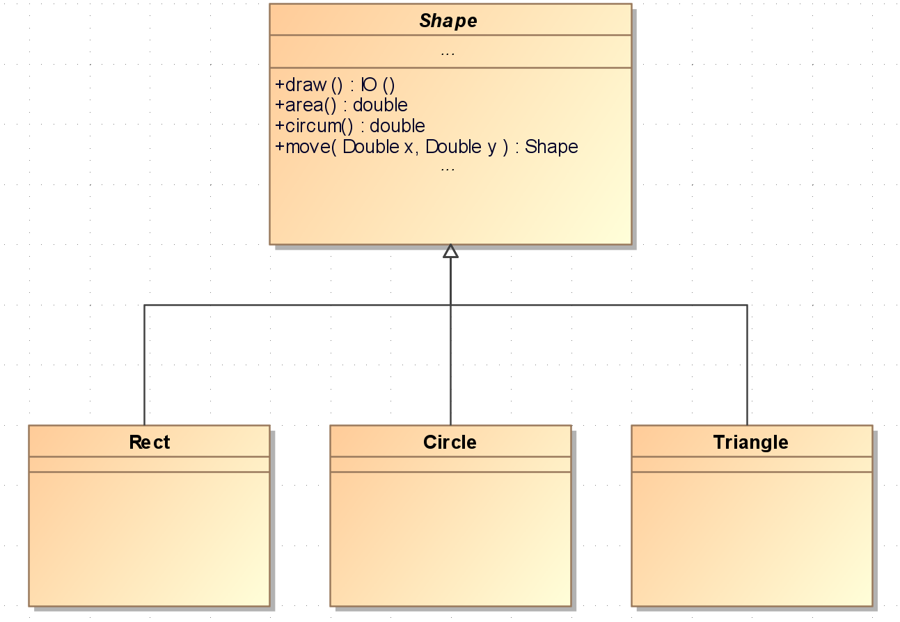

# Reconciling concepts from Functional Programming and Object Oriented Programming

Some time ago I came across a very interesting post on the Clean-Coder-Blog, 
that kept me busy for months until I finally decided to write this article.

In this post Uncle Bob tries to reconcile FP and OOP concepts by explaining that both approaches are
not mutually exclusive but both provide useful principles that go very well together and in fact are complementary:

> In this blog I will make the case that while OO and FP are orthogonal, 
> they are not mutually exclusive. 
> That a good functional program can (and should) be object oriented. 
> And that a good object oriented program can (and should) be functional. 
>
> [quoted from Uncle Bob's Clean Coder Blog](https://blog.cleancoder.com/uncle-bob/2018/04/13/FPvsOO.html)

He starts his argument by trying to convey the essence of both FP and OOP by giving very condensed definitions. 

## Defining OOP

He gives the following characterisation of OOP:

> The technique of using dynamic polymorphism to call functions without the source code of the caller 
> depending upon the source code of the callee.

With this short stanza Uncle Bob points to the core of object orientation since its first incarnation in
the Smalltalk language:

In an OO language a call of methods on a target object is dispatched based on the target object's type, its `class`.

So a method call `shape.draw()` may invoke different code based on the `class` of the actual shape object.

The code of the `draw` method of class `Rectangle` may be different from the code in `Circle.draw()`.

Client code will just call `shape.draw()`, not even knowing which actual `Shape` sub-class it's working on. This kind of 
polymorphism provides a very useful decoupling of clients from the callees by using the methods of the baseclass `Shape`
as the API for all Objects inheriting `Shape`.

This mechanism allows to build elegant design like the 
[Model-View-Controller (MVC)](https://en.wikipedia.org/wiki/Model%E2%80%93view%E2%80%93controller) pattern 
which is at the core of Smalltalks GUI and which influenced many similar designs in other OO-languages. 

> MVC is the seminal insight of the whole field of graphical user interfaces. 
> I believe the MVC work was the first to **describe** and implement **software constructs in terms of their responsibilities.** 
> I also believe that MVC was the first significant **use of protocols to define components** instead of using 
> concrete implementations -- each controller class had a certain set of messages it had to respond to, 
> as did each view class, but otherwise there were no constraints on what they did and how they did it.
>
> [quoted from the C2 Wiki](http://wiki.c2.com/?ModelViewControllerHistory)

This quote conveys two major achievements of OOP:

1. Decomposing software into separate components with distinct responsibilities
2. Using protocols - APIs or interfaces in todays lingo - to decouple those components and allow for 
varying implementations.

## Defining FP

Uncle Bob then gives a very brief characterization of functional programming:

> Referential Transparency – no reassignment of values.
>
> [quoted from Uncle Bob's Clean Coder Blog](https://blog.cleancoder.com/uncle-bob/2018/04/13/FPvsOO.html)

Referential transparency is implying **purity** as explained in the following definition from Wikipedia:

> An expression is called **referentially transparent if it can be replaced with its corresponding value**
> (and vice-versa) without changing the program's behavior. 
> This **requires that the expression be pure**, that is to say **the expression value must be the same for the 
> same inputs** and its **evaluation must have no side effects**.
> 
> [quoted from Wikipedia](https://en.wikipedia.org/wiki/Referential_transparency)

The second part of Uncle Bob's stanza may be implied by this definition, but I prefer to see it as separate 
yet closely related principle, namely **immutability**:

> In object-oriented and functional programming,  an immutable object (unchangeable object) is an object whose **state 
> cannot be modified after it is created**. [...]
> 
> [Quoted from Wikipedia](https://en.wikipedia.org/wiki/Immutable_object) 
 
## There is no FP vs OOP

After this dense characterization of the two programming paradigms Uncle Bob continues his arguments like follows:

The concepts of Polymorphism and Referential Transparency are orthogonal. You can have Polymorphism without
Referential Transparency – and vice versa.

But orthogonality does not imply that both concepts are mutually exclusive. 
It is possible to have languages that support both Dynamic Polymorphism and Referential Transparency.  
It is not only possible, but even desirable to combine both concepts. 

1. Dynamic Polymorphism is desirable as it allows building strongly decoupled designs.

    > Dependencies can be inverted across architectural boundaries. 
    > They are testable using Mocks and Fakes and other kinds of Test Doubles. 
    > Modules can be modified without forcing changes to other modules. 
    > This makes such systems much easier to change and improve.
    > 
    > Uncle Bob

2. Referential Transparency is desirable as it allows designs that are much easier to understand, to reason about,
   to change and to improve. It also allows designs that are much better suited for scalability and concurrency
   as the chances of race conditions etc. are drastically reduced.  
  
Uncle Bob concludes that Dynamic Polymorphism and Referential Transparency are both desirable as part 
of software systems: 

> A system that is built on both OO and FP principles will **maximize flexibility, 
> maintainability, testability, simplicity, and robustness**.   
> 
> Uncle Bob
  
## Ad-hoc Polymorphism and Referential Transparency in Haskell

In this section I'm showcasing how those two concepts are supported in Haskell and can be combined without sacrificing FP principles.

1. **Referential Transparency**
    
    Haskell is one of the rare incarnations of a purely functional language.
    So it goes without saying that Referential Transparency, Purity and Immutability are a given in Haskell.
    Yes, there are things like `unsafePerformIO` but overall
    it's very easy to write clean code in Haskell due to the strict separation of pure and impure code.
    
    Referential Transparency in Haskell is so much a given that it's quite possible to apply
    equational reasoning to proof certain properties of Haskell programs.
    See for example the following 
    [Proof of Functor laws for the Maybe type](https://thma.github.io/LambdaBlog/posts/2020-04-17-maybe-functor-law-proof.html).
    What's remarkable here is that you can use the same language to write your code and to 
    reason about it. 
    This is not possible in languages that do not provide Referential Transparency. To reason about
    programs in such languages you'll have to use external models like an abstract stack + register machine.
    

2. **Ad-hoc Polymorphism** 

    Being able to overload functions and operators with different implementations depending on the 
    type of its arguments is called Ad-hoc Polymorphism.
    For example, the `+` operator does something entirely different when applied to floating-point 
    values as compared to when applied to integers. In Haskell, this kind of polymorphism is achieved with 
    type classes and class instances.
    
    Haskell's type classes are quite different from the classes 
    in OOP languages. Yet they have more in common with interfaces, in that they 
    specify a set of functions with their respective type signatures, to be implemented by instance 
    declarations.

Let's have a look at a simple example that is frequently used in introductions to OOP: 
a class hierarchy representing geometrical shapes. In a typical OO language, we would
have an abstract base class `Shape` specifying a set of methods, and concrete classes 
`Rect`, `Circle`, `Triangle`, etc. which would implement specific behaviour.

This simple class hierarchy is shown in the following UML diagram:




In Haskell there is no inheritance between types. But with type classes we can specify an
*interface* which must be implemented by types instantiating the type class. So we start with a 
`Shape` type class:


```haskell
-- | The Shape type class. It defines four functions that all concrete Shape types must implement.
class Shape a where
  -- | render a Shape
  draw   :: a -> IO ()
  -- | move a Shape by an x and y amount
  move   :: (Double,Double) -> a -> a
  -- | compute the area of a Shape
  area   :: a -> Double
  -- | compute the circumference of a Shape
  circum :: a -> Double
```

Any concrete type `a` instantiating `Shape` must implement the four functions `draw`, `move`,
`area` and `circum`. 

We start with a `Circle` type:

```haskell
-- | a circle defined by the centre point and a radius
data Circle = Circle Point Double deriving (Show)

-- | a point in the two-dimensional plane
data Point = Point Double Double

-- | making Circle an instance of Shape
instance Shape Circle where
  draw       (Circle centre radius) = putStrLn $ "Circle [" ++ show centre ++ ", " ++ show radius ++ "]"
  move (x,y) (Circle centre radius) = Circle (movePoint x y centre) radius
  area   (Circle _ r) = r ^ 2 * pi
  circum (Circle _ r) = 2 * r * pi

-- | move a Point by an x and y amount
movePoint :: Double -> Double -> Point -> Point
movePoint x y (Point x_a y_a) = Point (x_a + x) (y_a + y)
```

As you can see, I'm not going to implement any real graphical rendering in `draw` but simply
printing out the coordinates of the centre point and the radius.

But at least `area` and `circum` implement the well-known geometrical properties of a circle.

Following this approach it's straightforward to implement data types `Rect` and `Triangle`. Let's start with
`Rect`:

```haskell
-- | a rectangle defined by to points (bottom left and top right corners) 
data Rect = Rect Point Point deriving (Show)

-- | making Rect an instance of Shape
instance Shape Rect where
  draw       (Rect a b) = putStrLn $ "Rectangle [" ++ show a ++ ", " ++ show b ++ "]"
  move (x,y) (Rect a b) = Rect a' b'
    where
      a' = movePoint x y a
      b' = movePoint x y b
  area rect   = width * height
    where
      (width, height) = widthAndHeight rect
  circum rect = 2 * (width + height)
    where
      (width, height) = widthAndHeight rect

-- | computes the width and height of a rectangle, returns them as a tuple
widthAndHeight :: Rect -> (Double, Double)
widthAndHeight (Rect (Point x_a y_a) (Point x_b y_b)) = (abs (x_b - x_a), abs (y_b - y_a))
```

There is nothing special here, we are just implementing the functions spefified by the `Shape` type class
in a most simple way.

On to `Triangle`: 

```haskell
-- | a triangle defined by three points
data Triangle = Triangle Point Point Point deriving (Show)

-- | making Triangle an instance of Shape
instance Shape Triangle where
  draw       (Triangle a b c) = putStrLn $ "Triangle [" ++ show a ++ ", " ++ show b ++ ", " ++ show c ++ "]"
  move (x,y) (Triangle a b c) = Triangle a' b' c'
    where
      a' = movePoint x y a
      b' = movePoint x y b
      c' = movePoint x y c
  area   triangle = sqrt (s * (s - a) * (s - b) * (s - c)) -- using Heron's formula
    where
      s = 0.5 * circum triangle
      (a, b, c) = sides triangle
  circum triangle = a + b + c
    where
      (a, b, c) = sides triangle

-- | computing the length of all sides of a triangle, returns them as a triple
sides :: Triangle -> (Double, Double, Double)
sides (Triangle x y z) = (distance x y, distance y z, distance x z)

-- | compute the distance between two points
distance :: Point -> Point -> Double
distance (Point x_a y_a) (Point x_b y_b) = sqrt ((x_b - x_a) ^ 2 + (y_b - y_a) ^ 2)

-- | provide a dense representation of a point
instance Show Point where
  show (Point x y) = "(" ++ show x ++ "," ++ show y ++ ")"
```

Now let's create three sample instances:

```haskell
rect :: Rect
rect = Rect (Point 0 0) (Point 5 4)

circle :: Circle
circle = Circle (Point 4 5) 4

triangle :: Triangle
triangle = Triangle (Point 0 0) (Point 4 0) (Point 4 3)
```

Now we have all ingredients at hand for a little demo. 

The type class `Shape` specifies a function `draw :: Shape a => a -> IO ()`.
This function is polymorphic in its argument: it will take an argument of any type `a` 
instantiating `Shape` and will perform an `IO ()` action, rendering the shape to the console in our case.

Let's try it in GHCi:

```haskell
> draw circle
Circle [(4.0,5.0), 4.0]
> draw rect
Rectangle [(0.0,0.0), (5.0,4.0)]
> draw triangle
Triangle [(0.0,0.0), (4.0,0.0), (4.0,3.0)]
```

By importing the reversed application operator `(&)` we can create a more OOP look-and-feel to our code:

```haskell
> import Data.Function
> circle & draw
Circle [(4.0,5.0), 4.0]
```

We can use the `(&)` operator to even work in a **fluent api** style:

```haskell
main :: IO ()
main = do
  rect
    & move (4,2)
    & draw
  
  rect
    & draw

  circle
    & move (4,2)
    & draw

  circle
    & draw

-- and then in GHCi:
> main
Rectangle [(4.0,2.0), (9.0,6.0)]
Rectangle [(0.0,0.0), (5.0,4.0)]
Circle [(8.0,7.0), 4.0]
Circle [(4.0,5.0), 4.0]
```

In Haskell all values are immutable: printing the original shapes a second times 
demonstrates that operations like move are not destructive. 

So with this little setup we have shown that Haskell allows us to have both: Referential Transparency plus ad-hoc
polymorphism. That is, we can use the essential elements of OOP and FP in one language.

## Heterogeneous collections

In Haskell, container types like lists are polymorphic, but it is not possible to define a list like this:

```haskell
shapes :: [Shape]
shapes = [circle,rect,triangle]
```

because type classes are not types, but constraints.

So in haskell a list like `[circle,rect,triangle]` is considered to be heterogeneous, as the concrete
types of all the elements differ.

There are [several ways to have heterogeneous collections in Haskell](https://wiki.haskell.org/Heterogenous_collections).
I will demonstrate just one of them, which is based on *existential types*.

Once we activate the `ExistentialQuantification` language extension, we can define a data type
`ShapeType` with a single constructor `MkShape` that will take any instance of a concrete type
instantiating the `Shape` type class:

```haskell
{-# LANGUAGE ExistentialQuantification #-}

data ShapeType = forall a . Shape a => MkShape a
```

Now we can make `ShapeType` an instance of `Shape` which will delegate all function calls to
the wrapped types:

```haskell
instance Shape ShapeType where
  area     (MkShape a) = area a
  circum   (MkShape a) = circum a
  draw     (MkShape a) = draw a
```

Now we can define a list of shapes as follows:

```haskell
shapes :: [ShapeType]
shapes = [MkShape rect, MkShape circle, MkShape triangle]
```

And finally, we are able to work with this list just with any other:

```haskell
main :: IO ()
main = do
  print $ map area shapes
  print $ map circum shapes
  mapM_ draw shapes

-- and then in GHCi:
> main
[20.0,50.26548245743669,6.0]
[18.0,25.132741228718345,12.0]
Rectangle [(0.0,0.0), (5.0,4.0)]
Circle [(4.0,5.0), 4.0]
Triangle [(0.0,0.0), (4.0,0.0), (4.0,3.0)]
```

**Still work in progress**

I still have to find out why

```haskell
instance Shape ShapeType where
  area     (MkShape a) = area a
  circum   (MkShape a) = circum a
  draw     (MkShape a) = draw a
  move (x,y) (MkShape i) =  move (x,y) i
```

does not compile, with 